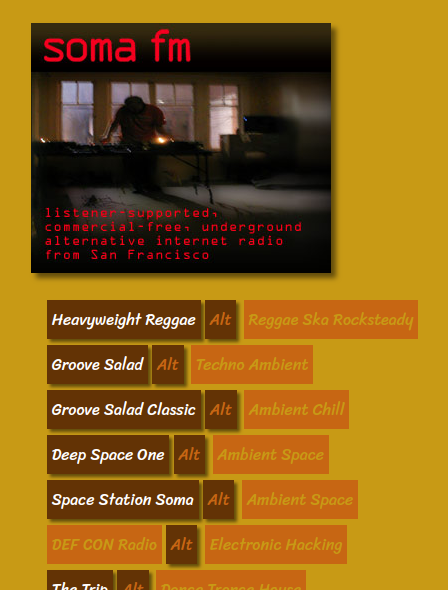

# vlc_wrapper_sfm
VLC Wrapper Script for SFM: flask.Flask(), flask.render_template, csv.reader()



## Virtual Environment

A Python virtual environment helps prevent changes to _system Python_ which would render an OS unstable. For example, if a Python module requires a previous version of a dependency, which _system Python_ also uses, and then changes such an existing dependency to another version, system instability can result. So, a Python virtual environment can help contain Python development within its own sandbox to help prevent it from knocking the swing set over or tilting the merry-go-round. For developers, virtual environments can become a system security measure of sorts.

Below, is an example of virtual environment creation:

```shell
user_foo@foo_host:~/Desktop$ python3 -m venv foo
user_foo@foo_host:~/Desktop$ cd foo
user_foo@foo_host:~/Desktop/foo$ ls -l
total 20
drwxrwxr-x 2 user_foo user_foo 4096 Jul  1 10:11 bin
drwxrwxr-x 2 user_foo user_foo 4096 Jul  1 09:30 include
drwxrwxr-x 3 user_foo user_foo 4096 Jul  1 09:30 lib
lrwxrwxrwx 1 user_foo user_foo    3 Jul  1 09:30 lib64 -> lib
-rw-rw-r-- 1 user_foo user_foo   69 Jul  1 10:10 pyvenv.cfg
drwxrwxr-x 3 user_foo user_foo 4096 Jul  1 10:10 share
$ source bin/activate
(foo) user_foo@foo_host:~/Desktop/foo$
```

## Run the App

To run the app, enter the following command line arguments in a Unix-like terminal emulator. `source vlc_wrapper_sfm.sh` will do the same thing.

```shell
$ . vlc_wrapper_sfm.sh
```

```shell
#! /bin/dash

export FLASK_ENV=development
export FLASK_APP=vlc_wrapper_sfm
flask run
```

`#! /bin/dash` starts with a [shebang](https://en.wikipedia.org/wiki/Shebang_(Unix)#Magic_number). The space after the shebang is optional.

>The shebang is actually a human-readable instance of a magic number in the executable file, the magic byte string being **0x23 0x21**, the two-character encoding in ASCII of `#!`. This magic number is detected by the _exec_ family of functions, which determine whether a file is a script or an executable binary. The presence of the shebang will result in the execution of the specified executable, usually an interpreter for the script's language.

## Imports

```python
from flask import Flask
from flask import render_template
from csv import reader
```

- `flask.Flask()` to instantiate the `Flask` class
- `flask.render_template()` to render a Jinja2 template for Web page display.
- `csv.reader()` to create a CSV reader object to make the database available to Python

## Global Variables

```python
APP = Flask(__name__)
```

Instantiates the `Flask` class for a standalone application that will not be imported into another application.

```python
GENRES_URL = {}
```

The dictionary will contain the [SomaFM](http://somafm.com/) station name, its genres, its directory name, along with two integers that specify the [Icecast](http://icecast.org/) server. But there does not seem to be any rhyme or reason for which particular numbers should be applied, just as a station's `.pls` file may contain a half-dozen IPs. Plenty of Icecast links. No complaints here.

```python
STATION_NAMES = []
```

SomaFM station names will be stored in a list which enables ordered indices. `GENRES_URL` and `STATION_NAMES` are generated at the same time while iterating through the `csv.reader()` object.

## Decorator

```python
@APP.route('/')
```

The decorator modifies the `index()` method, where the route is set. In this case, the path is the localhost's root.

## Template

```python
return render_template('template.html', GENRES_URL=GENRES_URL, STATION_NAMES=STATION_NAMES)
```

The `template.html` file is stored in the `templates/` directory because that is where Flask will look for it.

The web page's template will be rendered by the [Jinja](https://palletsprojects.com/p/jinja/) template engine.

### SomaFM Logo

SomaFM asks for inclusion of a logo if a developer links to their streams. The largest logo link becomes useful as a header.

```html
<p>
  <a href="http://somafm.com/">
    
  </a>
</p>
```

### Looping Structure

```html

<li>{# station name | genres #}
  <a href="http://ice{{ GENRES_URL[i][2] }}.somafm.com/{{ GENRES_URL[i][1] }}-128-aac" target="_blank" class="blk1">
    {{ i }}
  </a>
  <a href="http://ice{{ GENRES_URL[i][3] }}.somafm.com/{{ GENRES_URL[i][1] }}-128-aac" target="_blank" class="blk2">
    Alt
  </a>
  <div class="blk3">
    {{ GENRES_URL[i][0] }}
  </div>
</li>

```

Above is an example of a Jinja engine looping structure, from `` to ``. `{# station name | genres #}` is an example of a comment. Expressions are inserted using handlebar/mustache-style syntax. The link above will end up something like `http://ice3.somafm.com/reggae-128-aac`. 

## If Standalone

If the app runs as a standalone, then `APP.run()` will be executed. See `flask run` in the shell script above.

```python
if __name__ == '__main__':
    APP.run()
```

## vlc_wrapper_somafm_bottle.py

[Bottle microframework](https://bottlepy.org/docs/dev/) differs from [Flask microframework](https://flask.palletsprojects.com/en/1.1.x/) in various ways, but they are generally the same.

```python
from csv import reader
from bottle import route
from bottle import SimpleTemplate
from bottle import run
```

- `bottle.route()` [class wraps a route callback along with route specific metadata and configuration and applies Plugins on demand.](https://bottlepy.org/docs/dev/api.html#bottle.Route)
- `bottle.SimpleTemplate.render()` renders [the template using keyword arguments as local variables.](https://bottlepy.org/docs/dev/stpl.html#bottle.SimpleTemplate.render)
- SimpleTemplate instance: `TPL = SimpleTemplate(name=f'{PROJ_DIR}/views/template.tpl')`
- `return TPL.render(data=DATA, names=NAMES)` returns data to the `bottle.SimpleTemplate.render()` instance.
- `run(host='localhost', port=8080)` runs the rendered template for web page display. `localhost` can be replaced with `127.0.0.1` or any typical loopback address.

### template.tpl

```python
% for i in names:
    ...
% end
```

The basic difference in the template is the syntax for the looping structure.

[](https://ko-fi.com/R6R72LISM)
